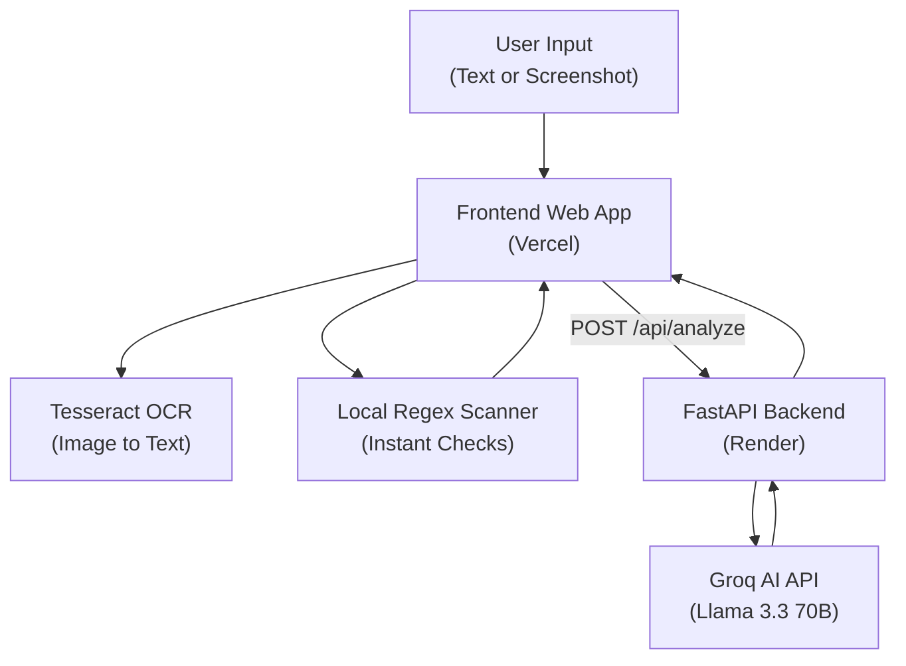
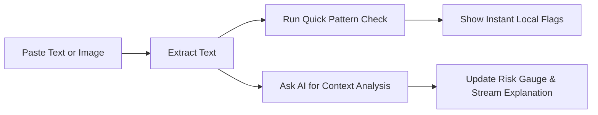

# 🛡️ AI Red Flag Detector

A web tool that helps you check if a suspicious email, message, link, or code snippet is a scam or security risk. 

It combines **instant local pattern matching** (checking for urgent language, fake domains, SQL injection, etc.) with an **AI second opinion** (using Llama 3.3 on Groq) to explain *why* something might be dangerous in plain language.

---

## 🚀 Features

- **Instant Pattern Scan**: Checks for known scam patterns locally in your browser (urgency tactics, typosquat links, raw IPs, code injection).
- **AI Second Opinion**: Uses AI to understand context and catch subtle scams that basic pattern rules miss.
- **Screenshot & Clipboard Paste (`Ctrl + V`)**: Paste or drop an image of a message, and OCR extracts the text automatically for scanning.
- **Live Auto Check (500ms)**: Scans live as you type without needing to press enter every time.
- **Risk Score & Gauge**: Displays a visual score from 0 (Safe) to 100 (High Risk) with detected risk tags.
- **English & Hindi Support**: Full interface and AI explanations in both English and Hindi (हिंदी).
- **Dark, Light & Terminal Themes**: Switch visual themes easily from the top menu.

---

## 📐 How It Works (Architecture)

### System Overview



### Scan Flow



---

## 📁 Project Structure

```
AI-red-flag-detector/
├── frontend/
│   └── index.html        # Main dashboard UI, styling, and local regex scanner
├── backend/
│   ├── main.py            # FastAPI server entry point
│   ├── llm_analyzer.py     # Groq AI call and response parsing
│   ├── requirements.txt    # Python packages needed
│   └── .env.example        # Environment variables template
├── vercel.json             # Vercel deployment configuration
└── README.md               # Project documentation
```

---

## ⚙️ Running Locally

### 1. Start the Backend (FastAPI)

1. Go to the backend folder:
   ```bash
   cd backend
   ```
2. Create and activate a virtual environment:
   ```bash
   python -m venv venv
   # On Windows:
   venv\Scripts\activate
   # On Mac/Linux:
   source venv/bin/activate
   ```
3. Install dependencies:
   ```bash
   pip install -r requirements.txt
   ```
4. Create a `.env` file:
   ```bash
   cp .env.example .env
   ```
   Add your free Groq API key from [console.groq.com](https://console.groq.com):
   ```env
   GROQ_API_KEY=your_api_key_here
   ```
5. Run the server:
   ```bash
   uvicorn main:app --reload --port 8000
   ```

### 2. Open the Frontend

You can open `frontend/index.html` directly in your browser, or start a simple local server:
```bash
cd frontend
python -m http.server 8080
```
Then open `http://localhost:8080` in your browser.

---

## ☁️ Deployment

- **Frontend**: Hosted on **Vercel** (`frontend/index.html`).
- **Backend**: Hosted on **Render** (`backend/main.py`).

---

## 📜 License

MIT License.
