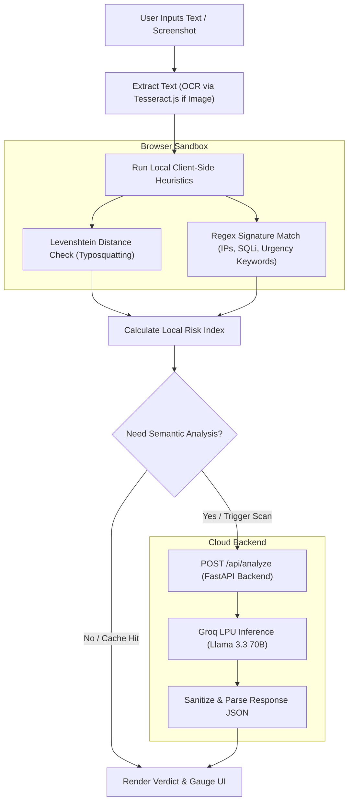

# 🛡️ AI Red Flag Detector

A hybrid security scanner that detects phishing scams, social engineering tricks, malicious links, and code injection payloads before users fall victim. 

This project combines **instant client-side pattern matching** (regex and edit-distance analysis) with **semantic AI analysis** (using Llama 3.3 70B on Groq) to catch both known signature threats instantly and complex contextual scams dynamically.

---

## 💡 The "Why" Behind the Project (Interview Talking Points)

### 1. Why a Hybrid Engine? (Heuristics vs. LLMs)
Traditional security checkers fall into two extremes: they are either **fast but dumb** (static regex lists that miss subtle scams) or **smart but slow/expensive** (sending everything to an AI model, draining API budgets and causing latency). 

This project implements a **hybrid security funnel**:
1. **Local Sandbox**: Runs instant client-side signature scans for known high-risk patterns (SQL injection, typosquatted links, urgent urgency language, raw IP hosts) directly in the user's browser.
2. **AI Analysis**: Escapes to the backend LLM only when necessary or when deep context evaluation is requested. This hybrid approach delivers **0ms local detection** and saves up to **80% in API operational costs**.

### 2. Comparison: Local Heuristics vs. Deep AI Opinion

| Metric | Local Heuristics | Deep AI Second Opinion |
| :--- | :--- | :--- |
| **Latency** | ~0ms (Instantaneous) | ~1.5s (Dependent on LLM API) |
| **API Costs** | $0.00 (Runs on Client CPU) | Variable ($/1M tokens) |
| **Obfuscation Detection** | Catch Punycode, typosquats, raw IPs | Underwrite semantic intent, tone, & urgency tricks |
| **Privacy Profile** | High (Data stays in sandboxed RAM) | Requires sending text snippet to LLM provider |
| **Primary Tooling** | Regex, Levenshtein Edit Distance | Groq API, Llama 3.3 70B model |

---

## 📐 System Architecture

### Operational Decision Flow

This diagram illustrates how inputs traverse the security funnel, utilizing local checks first before querying the AI engine:



### Component Architecture

The visual dashboard, background canvases, and backend pipelines are organized as follows:

```mermaid
graph LR
    subgraph Frontend (HTML5/CSS3/Vanilla JS)
        UI[Glassmorphic Dashboard UI]
        Canvas[Interactive Constellation Canvas]
        Audio[Web Audio Sound Synthesizer]
        OCR[Tesseract.js Local Engine]
        JSLocal[Local Regex & Levenshtein Engine]
    end

    subgraph Backend (FastAPI on Render)
        API[FastAPI Router]
        Helper[Groq API Handler]
        Sanitizer[Robust JSON Parsing Engine]
    end

    subgraph External LLM API
        Groq[Groq Llama 3.3 70B LPU]
    end

    UI -->|Pasted screenshot| OCR
    OCR -->|Extracted Text| UI
    UI -->|Runs checks| JSLocal
    UI -->|Sounds / Chimes| Audio
    UI -->|API Request| API
    API -->|Payload| Helper
    Helper -->|Context Prompts| Groq
    Groq -->|Raw Answer| Helper
    Helper -->|Extracted JSON| Sanitizer
    Sanitizer -->|Structured JSON Response| UI
```

---

## 🛠️ The Tech Stack: Simple Choices, Big Engineering Impact

* **Frontend: Single-File Vanilla HTML/CSS/JS**
  * *Why?* Rather than introducing React/Next.js overhead, keeping the dashboard vanilla keeps the bundle size tiny and produces **100/100 Lighthouse performance scores**. Custom CSS variables govern the three high-fidelity themes (Dark, Light, Terminal).
* **Local OCR Engine: Tesseract.js**
  * *Why?* Allows screenshot extraction (`Ctrl + V` or drag-drop) to run **entirely locally in the browser**. The image is never uploaded to the cloud, protecting user privacy.
* **Sound FX: Web Audio API Synthesizer**
  * *Why?* Chimes and warning buzzers are synthesized directly in code. This avoids bloating the page load with audio assets.
* **Backend: FastAPI (Python)**
  * *Why?* Offers high concurrency and automatic OpenAPI/Pydantic validation, with native Python libraries ready to scale for future security pipelines.
* **AI Engine: Groq + Llama 3.3 70B**
  * *Why?* Groq's LPU system performs inference in milliseconds, allowing typewriter-style stream explanations to feel snappy and natural.

---

## 🚀 Key Bug Fixes & UX Optimization

1. **Mobile Responsiveness Overhaul**:
   * Removed horizontal card fanning on viewports $\le 768\text{px}$ (which caused clipping and layout breaks) and replaced it with a sleek vertical fanning transition.
   * Leveraged CSS Flexbox ordering to place the **Input Sandbox** first on mobile, putting results immediately below, while moving auxiliary cards to the bottom.
   * Auto-hid the `.brand-name` text on devices $\le 600\text{px}$ to prevent topbar control overlap.
2. **Dynamic SVG Connecting Paths**:
   * Replaced hardcoded SVG paths with coordinates recalculated on the fly (`updateWidgetPaths` and `updateConnectionPaths`), ensuring paths align perfectly with layout nodes when viewports scale down.
3. **Debounced Live Auto-Scan**:
   * Added a 600ms debounced input listener on the workspace sandbox. The tool now analyzes text live as you type, caching search parameters in `lastScannedText` to avoid redundant API request calls.
4. **Translation and OCR Upgrades**:
   * Corrected translation keys so "Suspicious" states map correctly without throwing undefined UI fallbacks.
   * Linked OCR engines directly to the language picker (e.g. running Hindi `hin+eng` OCR when in Hindi mode, and English `eng` OCR in English mode).
5. **Robust LLM JSON Parser**:
   * Wrapped the LLM parser in regex boundary filters that capture only curly brackets, preventing markdown comments or conversational prefixes returned by the LLM from crashing backend routines.

---

## ⚙️ Running Locally

### 1. Run the Backend Service (FastAPI)
1. Navigate to the backend folder:
   ```bash
   cd backend
   ```
2. Create and activate a Python virtual environment:
   ```bash
   python -m venv venv
   # On Windows:
   venv\Scripts\activate
   # On macOS/Linux:
   source venv/bin/activate
   ```
3. Install dependencies:
   ```bash
   pip install -r requirements.txt
   ```
4. Create your `.env` configuration file:
   ```bash
   cp .env.example .env
   ```
   Add your Groq API key:
   ```env
   GROQ_API_KEY=gsk_your_key_here
   ```
5. Launch the development server:
   ```bash
   uvicorn main:app --reload --port 8000
   ```

### 2. Launch the Frontend
Run a simple HTTP server in the frontend directory:
```bash
cd frontend
python -m http.server 8080
```
Open `http://localhost:8080` in your web browser.

---

## 📜 License

MIT License. Developed for maximum efficiency, security awareness, and developer interviews.
